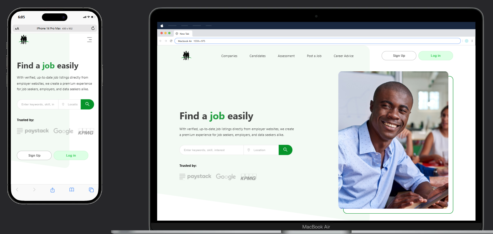

# GetaJobNG Clone



This project is a clone of the GetaJobNG landing page, a recruitment support platform and service that connects job seekers with various career opportunities in Nigeria. The design for this project was inspired by a Figma prototype, which can be found [here](<https://www.figma.com/design/s3nZ9JdH3dV5wAQJmzmBih/GetAJob-(Copy)?node-id=2-2&t=1Lj8y0t2q5UnBGXt-0>).

## Table of Contents

-   [Project Overview](#project-overview)
-   [Features](#features)
-   [Technologies Used](#technologies-used)
-   [Installation](#installation)

## Project Overview

GetaJobNG is a platform designed to help job seekers find employment opportunities across major cities in Nigeria, including Lagos and Port Harcourt. This clone replicates the user interface and functionality of the original site, allowing users to search for jobs, apply for positions, and access career advice.

## Features

-   **Responsive Design**: The site is fully responsive and works well on various devices.
-   **Interactivity**: Users can interact with the site through job searches, application submissions, and creating profiles to enhance their job-seeking experience.
-   **Job Listings**: Display of the latest job openings along with details and application links.

## Technologies Used

-   HTML5
-   CSS3
-   JavaScript
-   React (using Vite)

## Installation

To run this project locally, follow these steps:

1. Clone the repository:

    ```bash
    git clone https://github.com/CJay-Cipher/getajob-landing-page.git
    ```

2. Navigate to the project directory:

    ```bash
    cd getajob-landing-page
    ```

3. Install the required dependencies:

    ```bash
    npm install
    ```

4. Start the development server using Vite:

    ```bash
    npm run dev
    ```

5. Open your browser and go to `http://localhost:3000` to see the application.
